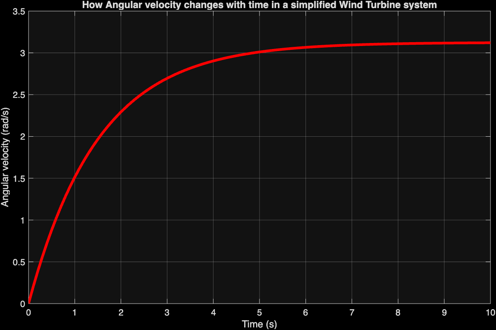
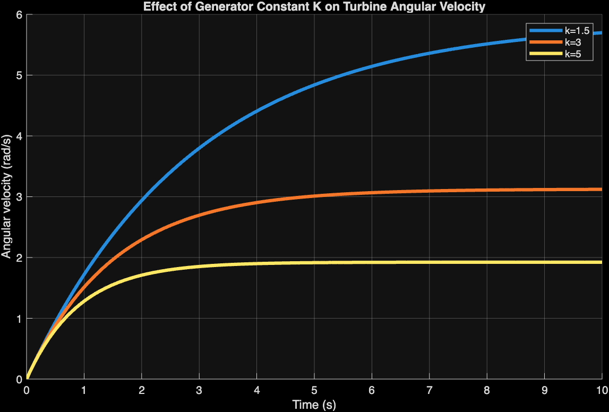
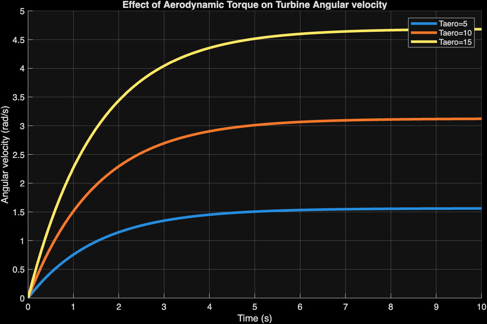
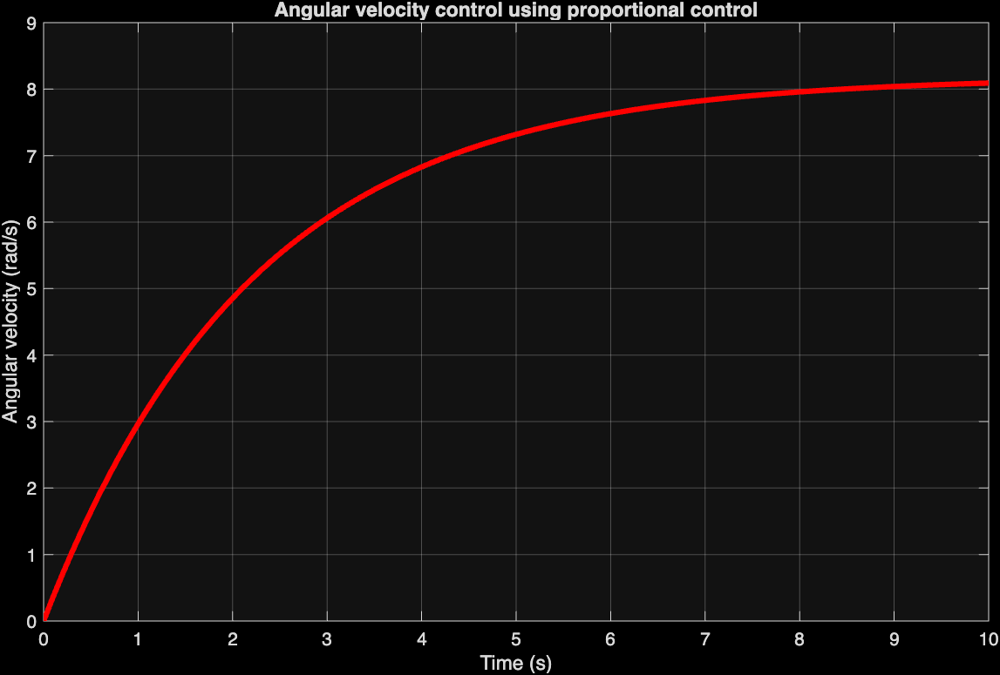

# Dynamic Modelling and Speed Control of a Wind Turbine-Generator System

MATLAB simulation of the rotational dynamics of a simplified wind turbine-generator drivetrain, including an investigation of proportional speed control.

## What it does

I wanted to understand why wind turbines actually need active speed control, rather than just accepting it as a given. So I built a model to see the dynamics for myself and find out what happens without it. Wind turbines need their shaft angular velocity kept within a safe range to convert energy efficiently and avoid mechanical overload. This project models a simplified drivetrain: a single rotating body driven by aerodynamic torque and resisted by generator torque and mechanical damping, and simulates how angular velocity evolves over time, both with fixed parameters and under proportional feedback control.

## System & governing equation

The drivetrain is modelled with lumped rotational inertia, a rigid shaft, and viscous damping proportional to angular velocity. Applying Newton's second law for rotational motion and balancing aerodynamic torque against generator and damping torque gives:

```
dω/dt = Taero/J − (K + b)/J · ω
```

where `Taero` is aerodynamic (driving) torque, `Tgen = Kω` is generator (resisting) torque, `b` is the damping coefficient, and `J` is the moment of inertia.

**Assumptions:** rigid shaft (no torsional deformation), damping modelled as linear viscous friction, aerodynamic torque treated as an external disturbance, generator electrical dynamics and grid interaction neglected.

## Results

**1. Base response (fixed parameters)** — the system rises quickly at first (large net torque), then settles as opposing torques grow with angular velocity, reaching a steady state where all torques balance.



**2. Effect of generator constant K** — increasing K raises the opposing generator torque for a given speed, so the system settles at a *lower* steady-state angular velocity.



**3. Effect of aerodynamic torque** — increasing `Taero` increases net driving torque, producing a faster rise and a *higher* steady-state angular velocity.



**4. Proportional control** — generator torque was made a function of the error between actual and reference angular velocity: `Tgen = Kp(ω − ω_ref)`. This let the system react dynamically to speed changes, but it did **not** settle at the 4 rad/s reference — it settled around 8 rad/s instead, since proportional control alone can't fully cancel the effect of aerodynamic torque, leaving a steady-state error.



## Files

| File | Description |
|---|---|
| `base_simulation.m` | Fixed-parameter response |
| `effect_of_K.m` | Sweeps generator constant K |
| `effect_of_aero_torque.m` | Sweeps aerodynamic torque |
| `proportional_control.m` | Adds proportional speed control |
| `Dynamic_modelling_and_speed_control_of_a_Wind_turbine_generator_system.docx` | Full original write-up |

## What I learned / next steps

Proportional control alone leaves a steady-state error. It needs a persistent speed deviation to generate the torque that balances the aerodynamic input, and there's nothing in the system to eliminate that offset. A natural extension would be adding an integral term (PI control) to drive the steady-state error to zero, or modelling variable/turbulent wind input instead of a constant Taero.
